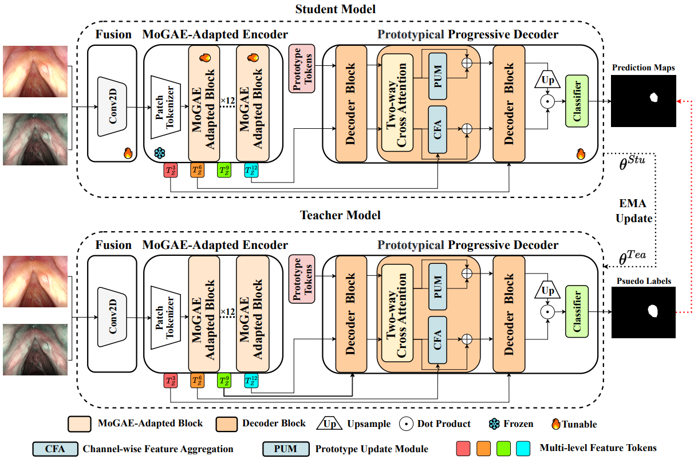

# Semi-Medsam

# Introduction
This repository contains the official PyTorch implementation for our paper, "Semi-MedSAM," which proposes a novel framework that fine-tunes a vision foundation model (e.g., SAM) for multi-modal medical endoscopic image segmentation in a semi-supervised setting.
In this work, we present a novel prompt-free, SAM-assisted framework named Semi-MedSAM for semi-supervised multi-modal medical image segmentation, which is designed to adapt large vision models while mitigating confirmation bias. Within its encoder, we first introduce a MoGAE-Adapter, which inserts a Mixture-of-Experts (MoE) based adapter into the SAM transformer blocks. This module dynamically routes feature tokens to specialized experts, allowing the network to adaptively capture the distinct semantic information of various lesion types from multi-modal inputs.  To decode these refined features, we then propose a Hierarchical Prototypical Decoder that comprises a prototype update module and a channel-wise feature aggregate module. In this decoder, prototype tokens, serving as queries, and image tokens, serving as keys, are refined in parallel. By leveraging this dual refinement process, the decoder achieves a finer granularity of feature representation, which ultimately leads to more precise segmentation predictions.



# Update
2025/7/30 the code released

# Installation
1. Create a conda environment
```bash
conda create -n medsam python=3.7
conda activate medsam
```

2. Install dependencies
```bash
pip install -r requirements.txt
```

# Usage
### Training
You need to first download the SAM's checkpoint: https://github.com/facebookresearch/segment-anything
and place it in 'root_path/checkpoints/SAM/sam_vit_b_01ec64 (1).pth'. Then fill in the blanks marked with '??' and run the following command:
```bash
python train.py --root_path ?? --label_num ?? 